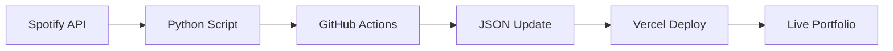

# pryceTharpe.dev – Personal Portfolio

A **Next.js 15 + TypeScript** portfolio showcasing my engineering projects, technical expertise, and personal interests. Features live Spotify data integration, photography galleries, and comprehensive project documentation.

| Environment | URL |
|-------------|-----|
| **Production** | <https://prycetharpe.dev> |
| **Preview** | <https://portfolio-seven-neon-7556zgb8u4.vercel.app> |

---

## ✨ Tech Stack

| Layer            | Tool / Library              | Notes                                                               |
|------------------|-----------------------------|---------------------------------------------------------------------|
| Runtime          | **Node 20 LTS**             | Executes React Server Components & API routes                        |
| Package manager  | **pnpm 8**                  | Fast, disk-efficient installs                                        |
| Framework        | **Next.js 15 (App Router)** | File-system routing · RSC · Image Opt · Edge & API routes            |
| UI library       | **React 19**                | Functional components & hooks                                        |
| Language         | **TypeScript (strict)**     | Path alias `@/*`                                                     |
| Styling          | **Tailwind CSS**            | Utility-first, JIT build                                             |
| Hosting / CI-CD  | **Vercel (Hobby)**          | Auto-deploy on `main`, preview URLs per PR                           |
| Analytics        | **Vercel Analytics**        | Performance monitoring and insights                                  |

---

## 🚀 Quick Start

```bash
# 0 Clone
git clone https://github.com/prycetharpe/portfolio.git
cd portfolio

# 1 Install deps
pnpm install        # or npm / yarn / bun

# 2 Run dev server
pnpm dev
# → http://localhost:3000
```

---

## 📂 Project Structure

```text
src/
│
├─ app/                  # Next.js routes
│   ├─ layout.tsx        # Root layout (fonts + Nav + Analytics)
│   ├─ page.tsx          # Landing page (Featured Projects + Experience)
│   ├─ about/            # About page with AI philosophy & Spotify widget
│   ├─ projects/         # Engineering project pages
│   ├─ photography/      # Photography galleries
│   └─ api/              # API routes (Azure photos, future endpoints)
│
├─ components/           # Re-usable UI components
│   ├─ Nav.tsx           # Navigation component
│   ├─ SpotifyWidget.tsx # Live Spotify data display
│   ├─ PhotoGallery.tsx  # Photography gallery components
│   └─ ContactDropdown*.tsx # Contact form components
│
├─ lib/                  # Utilities and data management
│   ├─ getProjects.ts    # Project data and categorization
│   ├─ spotify-data.ts   # Spotify data loading utilities
│   ├─ spotify-types.ts  # TypeScript interfaces
│   └─ azure-photos.ts   # Azure Blob Storage integration
│
├─ data/                 # Static data files
│   └─ spotify-data.json # Live Spotify listening data
│
└─ hooks/                # Custom React hooks
    └─ useAzurePhotos.ts # Azure photo loading hook
```

---

## 🎵 Live Features

### **Spotify Integration**
- **Real-time data**: Top artists, tracks, and daily favorites
- **Automated updates**: GitHub Actions fetch fresh data daily
- **Tech stack**: Python + Spotify API + GitHub Actions + TypeScript
- **Location**: Featured on About page in "Beyond Code" section

### **Photography Galleries**
- **Azure Blob Storage**: Secure, scalable image hosting
- **Dynamic collections**: NYC 2025, Mountains 2021, Zoo 2022
- **Optimized delivery**: SAS URLs with automatic expiration
- **Responsive design**: Mobile-first gallery layouts

---

## 🔧 NPM Scripts

| Script        | Action                                       |
| ------------- | -------------------------------------------- |
| `pnpm dev`    | Local dev server (hot reload with Turbopack) |
| `pnpm build`  | Production build → `.next/`                  |
| `pnpm start`  | Run the **built** app locally                |
| `pnpm lint`   | ESLint + TypeScript checks                   |

---

## 🤖 Automation & DevOps

### **GitHub Actions**
- **Spotify Data Sync**: Daily automated updates of listening data
- **Auto-deployment**: Vercel integration for seamless deployments
- **Security**: Secrets management for API credentials

### **Data Pipeline**


---

## 🌐 Deploy & Custom Domain

1. **Connect GitHub** repo to Vercel → every push to `main` auto-deploys
2. **Add domain** `prycetharpe.dev` in **Project ▸ Settings ▸ Domains** and follow DNS instructions
3. **HTTPS** is issued automatically

Manual redeploy of latest commit:
```bash
vercel --prod
```

---

## 🔐 Security & Privacy

- **No hardcoded secrets**: All API keys stored in environment variables
- **Secure image delivery**: Azure SAS URLs with time-limited access
- **GitHub Secrets**: Spotify credentials encrypted and secure
- **No PII exposure**: All personal data properly handled

---

## 🗺️ Roadmap

- [x] **Live Spotify integration** with automated data updates
- [x] **Photography galleries** with Azure Blob Storage
- [x] **AI philosophy section** showcasing ethical development approach
- [x] **Comprehensive project documentation** with technical details
- [ ] **Contact form** with email integration
- [ ] **Blog section** for technical write-ups
- [ ] **Performance optimization** with Lighthouse CI
- [ ] **End-to-end testing** with Playwright

---

## 🎯 Key Features

### **Professional Portfolio**
- **Featured Projects**: AI System Prompt, Azure ETL Pipeline, DJ Pete Beat Sequencer
- **Experience Timeline**: Mesh Systems internship, Purdue education
- **Technical Skills**: Full-stack development, cloud engineering, AI/ML

### **Personal Touch**
- **Music Integration**: Live Spotify data showing current listening habits
- **Photography**: Professional galleries showcasing creative work
- **AI Philosophy**: Thoughtful approach to responsible AI development

### **Technical Excellence**
- **Modern Stack**: Next.js 15, React 19, TypeScript, Tailwind CSS
- **Performance**: Optimized images, fast loading, responsive design
- **Automation**: GitHub Actions, automated deployments, live data updates

---

## 📚 Learn More

* **Next.js Docs** – [https://nextjs.org/docs](https://nextjs.org/docs)
* **Tailwind Docs** – [https://tailwindcss.com/docs](https://tailwindcss.com/docs)
* **Vercel Deploy** – [https://nextjs.org/docs/app/building-your-application/deploying](https://nextjs.org/docs/app/building-your-application/deploying)
* **Spotify Web API** – [https://developer.spotify.com/documentation/web-api](https://developer.spotify.com/documentation/web-api)

---

## 🤝 Contributing

This is a personal portfolio, but I'm open to suggestions and improvements! Feel free to:
- Open issues for bugs or suggestions
- Submit pull requests for improvements
- Reach out via [LinkedIn](https://www.linkedin.com/in/pryce-tharpe) or [email](mailto:tharpep_pro@outlook.com)

---

© 2025 Pryce Tharpe