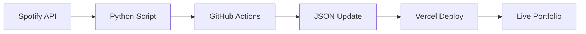

# pryceTharpe.dev – Personal Portfolio

A **Next.js 15 + TypeScript** portfolio showcasing engineering projects, technical expertise, and personal interests. Features live Spotify data integration and comprehensive project documentation.

| Environment | URL |
|-------------|-----|
| **Production** | <https://prycetharpe.dev> |
| **Preview** | <https://portfolio-seven-neon-7556zgb8u4.vercel.app> |

---

## Tech Stack

| Layer            | Tool / Library              | Notes                                                               |
|------------------|-----------------------------|---------------------------------------------------------------------|
| Runtime          | **Node 20 LTS**             | Executes React Server Components & API routes                        |
| Package manager  | **pnpm 8**                  | Fast, disk-efficient installs                                        |
| Framework        | **Next.js 15 (App Router)** | File-system routing · RSC · Image Opt · Edge & API routes            |
| UI library       | **React 19**                | Functional components & hooks                                        |
| Language         | **TypeScript (strict)**     | Path alias `@/*`                                                     |
| Styling          | **Tailwind CSS**            | Utility-first, JIT build                                             |
| Hosting / CI-CD  | **Vercel (Hobby)**          | Auto-deploy on `main`, preview URLs per PR                           |
| Analytics        | **Vercel Analytics**        | Performance monitoring and insights                                  |

---

## Quick Start

```bash
# 0 Clone
git clone https://github.com/prycetharpe/portfolio.git
cd portfolio

# 1 Install deps
pnpm install        # or npm / yarn / bun

# 2 Run dev server
pnpm dev
# → http://localhost:3000
```

---

## Project Structure

```text
src/
│
├─ app/                  # Next.js routes
│   ├─ layout.tsx        # Root layout (fonts + Nav + Analytics)
│   ├─ page.tsx          # Landing page (Featured Projects + Experience)
│   ├─ about/            # About page with AI philosophy & Spotify widget
│   ├─ projects/         # Engineering project pages
│   ├─ resume/           # Resume page
│   └─ api/              # API routes (Azure photos, future endpoints)
│
├─ components/           # Re-usable UI components
│   ├─ Nav.tsx           # Navigation component
│   ├─ SpotifyWidget.tsx # Live Spotify data display
│   └─ ContactDropdown*.tsx # Contact form components
│
├─ lib/                  # Utilities and data management
│   ├─ getProjects.ts    # Project data and categorization
│   ├─ spotify-data.ts   # Spotify data loading utilities
│   └─ spotify-types.ts  # TypeScript interfaces
│
└─ data/                 # Static data files
    └─ spotify-data.json # Live Spotify listening data
```

---

## Features

### Spotify Integration
- Real-time data: Top artists, tracks, and daily favorites
- Automated updates: GitHub Actions fetch fresh data daily
- Tech stack: Python + Spotify API + GitHub Actions + TypeScript
- Location: Featured on About page in "Beyond Code" section

---

## Scripts

| Script        | Action                                       |
| ------------- | -------------------------------------------- |
| `pnpm dev`    | Local dev server (hot reload with Turbopack) |
| `pnpm build`  | Production build → `.next/`                  |
| `pnpm start`  | Run the **built** app locally                |
| `pnpm lint`   | ESLint + TypeScript checks                   |

---

## Automation & DevOps

### GitHub Actions
- Spotify Data Sync: Daily automated updates of listening data
- Auto-deployment: Vercel integration for seamless deployments
- Security: Secrets management for API credentials

### **Data Pipeline**


## Key Features

### Professional Portfolio
- Featured Projects: AI System Prompt, Azure ETL Pipeline, DJ Pete Beat Sequencer
- Experience Timeline: Mesh Systems internship, Purdue education
- Technical Skills: Full-stack development, cloud engineering, AI/ML

### Personal Touch
- Music Integration: Live Spotify data showing current listening habits

### Technical Excellence
- Modern Stack: Next.js 15, React 19, TypeScript, Tailwind CSS
- Performance: Optimized images, fast loading, responsive design
- Automation: GitHub Actions, automated deployments, live data updates

---

## Learn More

- Next.js Docs: [https://nextjs.org/docs](https://nextjs.org/docs)
- Tailwind Docs: [https://tailwindcss.com/docs](https://tailwindcss.com/docs)
- Vercel Deploy: [https://nextjs.org/docs/app/building-your-application/deploying](https://nextjs.org/docs/app/building-your-application/deploying)
- Spotify Web API: [https://developer.spotify.com/documentation/web-api](https://developer.spotify.com/documentation/web-api)

---

## Contributing

This is a personal portfolio, but I'm open to suggestions and improvements. Feel free to reach out via [LinkedIn](https://www.linkedin.com/in/pryce-tharpe) or [email](mailto:tharpep_pro@outlook.com).

---

## License

This portfolio uses dual licensing:

- MIT License (see [LICENSE](LICENSE)) - Applies to source code, configuration files, and build tooling. You are free to use, modify, and distribute the code.

- All Rights Reserved (see [LICENSE-PERSONAL.md](LICENSE-PERSONAL.md)) - Applies to personal content including:
  - Resume/CV documents
  - Project descriptions and personal work content
  - Spotify listening data
  - Personal biographical information

The code is open source, but personal content remains protected. Feel free to fork and adapt the codebase for your own portfolio.

---

© 2025 Pryce Tharpe
